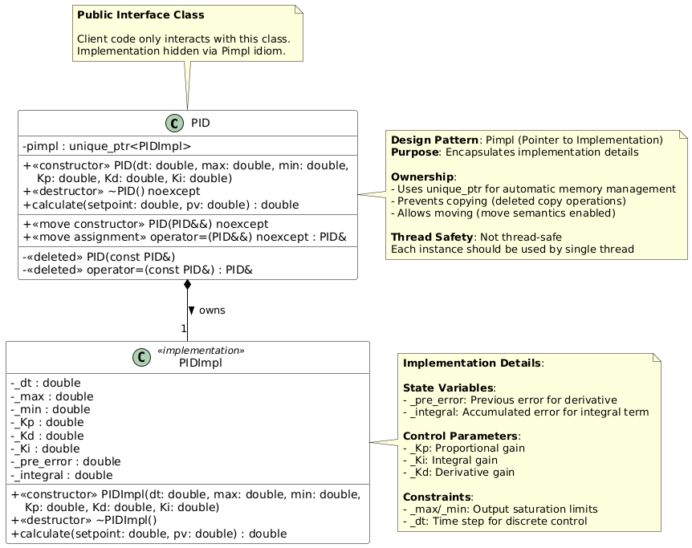

# Group 1 – TDD Exercise 

## C++ Boilerplate v2 Badges
[](https://github.com/shreyak-05/ENPM700_TDD_group1p2/actions/workflows/run-unit-test-and-upload-codecov.yml)

[](https://codecov.io/gh/shreyak-05/ENPM700_TDD_group1p2)


## Authors - Part1
|     Role      | Name  |
|---------------|-------------------------|
| **Driver**    | Shreya Kalyanaraman     |
| **Navigator** | Dayanidhi Kandade       |

## Authors - Part2
|     Role      | Name |
|---------------|-------------------------|
| **Driver**    | Anvesh Som  |
| **Navigator** | Daniel Zinobile    |


## Overview
This repository demonstrates Test-Driven Development (TDD) practices through the implementation of a PID controller class.
The driver cloned the [cpp-boilerplate-v2](https://github.com/cpp-boilerplate-v2) repository and configured it for continuous integration, unit testing, and code-coverage reporting.  
Part 1 focuses on designing and stubbing a **PID controller** class using Test-Driven Development.

## UML Diagram


## Unit Testing
- Implemented **five comprehensive GoogleTest cases** for the `PID` controller class.  
- Tests verify both **PID functionality** and **modern C++ compliance**.  
- Updated `CMakeLists.txt` to compile and link new test files.

## Key Features & Implementation

This project implements a **PID controller** in modern C++ demonstrating professional software engineering practices:

1. **Modern C++ Features**: Pimpl idiom, Rule of Five, move semantics, exception handling, and RAII with `std::unique_ptr`.

2. **Test-Driven Development**: Comprehensive GoogleTest suite written before implementation with high coverage tracked via Codecov.

3. **Collaborative Development**: Pair programming with role rotation and GitHub pull request code reviews.

4. **Professional Tooling**: CMake, Doxygen, clang-format, cppcheck, and Valgrind integration.

5. **CI/CD Pipeline**: Automated testing and coverage reporting using GitHub Actions.

### Test Coverage Overview
| # | **Test Name** | **Purpose** | **Expected Behavior** |
|:--:|:---------------|:------------|:----------------------|
| 1 | `SanityCheck` | Verifies correct proportional, integral, and derivative output. | Output ≈ 12.02 |
| 2 | `OutputClamping` | Ensures output is clamped within min/max limits using `std::clamp`. | Output ≤ 10.0, ≥ -10.0 |
| 3 | `ZeroError` | Confirms zero error yields zero control output. | Output = 0.0 |
| 4 | `InvalidConstructorParameters` | Checks proper exception handling for invalid parameters (`dt <= 0`, `max < min`). | Throws `std::invalid_argument` |
| 5 | `MoveSemantics` | Validates move constructor and move assignment. | Old instance invalidated, new instance valid |


## Build Files

### Clone
```bash

git clone git@github.com:shreyak-05/ENPM700_TDD_group1p2.git
cd ENPM700_TDD_group1p2
```

---

### Build & Test

```bash
cmake -S . -B build -DCMAKE_BUILD_TYPE=Debug -DCMAKE_EXPORT_COMPILE_COMMANDS=ON
cmake --build build

# Run unit tests
./build/test/cpp-check
```

---

### Static Analysis (cppcheck) & Formatting

```bash
# Static analysis (save to results/)
mkdir -p results
cppcheck --enable=all --inline-suppr --error-exitcode=1          --suppress=missingIncludeSystem --suppress=unknownMacro          -I libs/lib1          --std=c++17 --language=c++          --project=build/compile_commands.json          -i build/_deps          2> results/cppcheck.txt

# Formatting
clang-format -i --style=Google $(find . -name *.cpp -o -name *.hpp | grep -v "/build/")
```

---